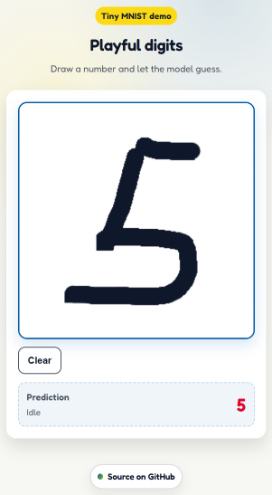

# MNIST TFJS Demo

A small, playful web app that lets you draw a digit and have a TensorFlow.js model guess it.
Includes a canvas UI, prediction latency/debug info, and export helpers for input data.

## Screenshot


## Features
- Draw on a 280x280 canvas, auto-downscale to 28x28 for MNIST
- TensorFlow.js GraphModel inference in the browser
- Debug panel with input stats, backend selection, and export tools
- Optional JSON/BMP export of the last input

## Demo (local)
1. Serve the folder (any static server works).
2. Open index.html in the browser.

Quick local serve (pick one):
```bash
# Python
python -m http.server 8000
# Node
npx serve .
```

Then open http://localhost:8000.

## Model
The app loads the TFJS graph model from:
```
./web_graph_model_CNN_48_80/model.json
```

## Data
Sample inputs live in:
```
test_data/
```

## Development notes
- main.js handles canvas input, preprocessing, and inference.
- index.html provides the UI and includes the TFJS scripts.
- The default backend is set as wasm for Android compatibility


## Python tooling (optional)
This repo also includes a Python environment for model export or experimentation:
```bash
# install dependencies
uv sync
```

## License
Specify a license here (e.g., MIT).

